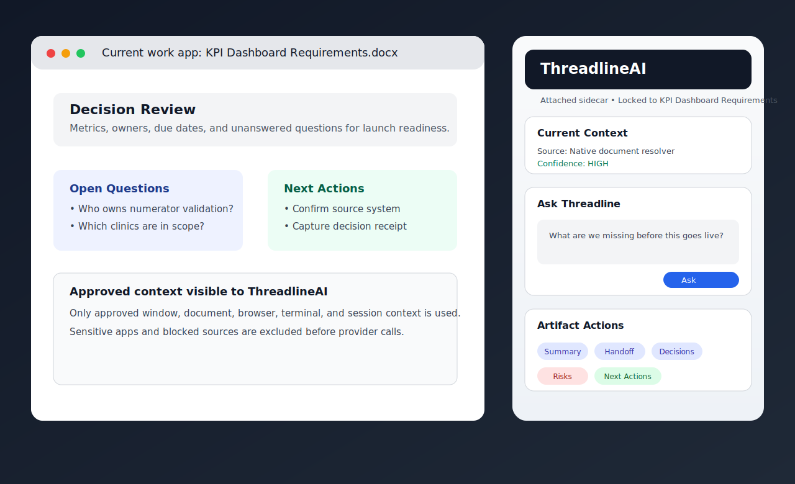
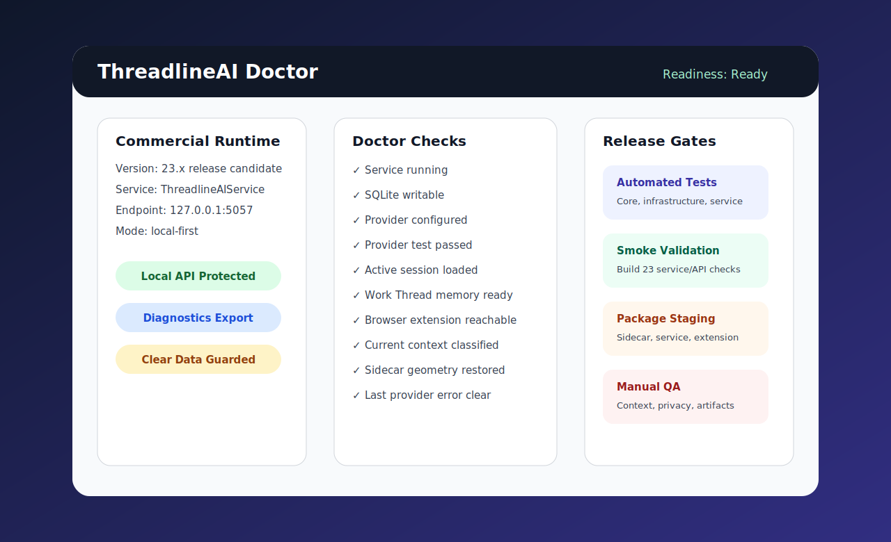

# ThreadlineAI

ThreadlineAI is a Windows-native, local-first AI sidecar for high-context work. It is designed to follow the user's approved work context across apps, browser tabs, documents, terminals, and sessions, then help turn that work into answers, summaries, handoffs, decisions, risks, and next actions.

Most AI tools start from a blank chat box. ThreadlineAI starts from the work surface the user is already using.



## What it is

ThreadlineAI is a context-aware desktop companion made of:

- a **WinUI 3 Windows sidecar** that can attach beside the selected, locked, or last active work window;
- an **ASP.NET Core local service** that acts as the context broker, provider bridge, health endpoint, and workflow API;
- a **SQLite-backed local memory layer** for sessions, approved context events, Work Threads, receipts, and artifacts;
- **context adapters** for Chrome/Edge, PowerShell, active windows, UI Automation, and file-backed document paths;
- a **provider abstraction** for OpenAI-compatible and Anthropic provider execution (OpenAI, Gemini, DeepSeek, OpenRouter, Local, Claude);
- **privacy-first controls** that make capture visible, previewable, pausable, and auditable.

The product direction is not invisible automation. ThreadlineAI should help users understand what context is being used, what is missing, and what is safe to send to a provider.

## Why try it

ThreadlineAI is worth trying if your real work lives across many places: dashboards, documents, tickets, browser tabs, terminals, meeting notes, and operational decisions.

It is built for the moments where a normal chatbot is clumsy:

- you are reviewing a dashboard and need the AI beside the dashboard;
- you are comparing browser research and want selected page context carried forward;
- you are moving between a document, terminal, and app window and do not want to rebuild context manually;
- you need a handoff, decision log, risk list, or next-action list from the work you just did;
- you want local-first control over provider setup, diagnostics, secrets, context, and data clearing;
- you want AI assistance that admits when it only has a window title instead of pretending it can see the page.

ThreadlineAI is not trying to be a generic AI landing page. It is a practical experiment in making AI follow the work, not just the prompt.

## Current product status

ThreadlineAI is an active pre-release product foundation moving from developer-run alpha toward commercially shaped Windows software.

Recent completed work includes:

- attached sidecar mode for active/selected/locked Windows targets;
- current-context source, confidence, summary, and diagnostics;
- provider-backed Ask path through the local service;
- stable chat-style transcript behavior;
- provider setup and secure local credential handling;
- browser extension bridge for Chrome/Edge page and selected-text context;
- PowerShell terminal adapter for notes, excerpts, and command output;
- Work Thread memory and artifact actions;
- Threadline Doctor readiness reporting;
- Windows Service lifecycle foundation;
- commercial package staging with MSI/signing hooks;
- first-run setup wizard;
- diagnostics export;
- guarded local-data clearing;
- automated service/security tests;
- Build 23 release-confidence gates, smoke tests, and release validation;
- screenshot/OCR consent decisions persisted across app restarts via SQLite.

Known limitations:

- Ambient capture transcription requires a provider with Whisper-compatible transcription support (e.g. OpenAI). Providers without transcription capability will produce audio and metadata only.
- Layout analysis and full visual layout extraction remain future work.
- Screenshots in this README and docs are illustrative SVG placeholders, not captures of the running application.

Honest boundary: this is not yet a finished general-availability enterprise SKU. It is a serious Windows product foundation with real commercial direction and enough structure to test, evaluate, harden, and package.

## Screenshots

> **Note:** The images below are **illustrative SVG placeholders**, not real screenshots of the running application. They communicate the intended product flow. Real screenshots will be captured from a signed Windows build before general availability. See [`docs/SCREENSHOTS.md`](docs/SCREENSHOTS.md) for the capture plan and naming standards.

| Sidecar overview | Doctor/readiness |
| --- | --- |
|  |  |

## Core capabilities

### Attached Windows sidecar

The Windows sidecar can attach beside a selected, locked, or followed work target. The user can also park it at the screen edge when they do not want the sidecar moving with the active window.

Useful for:

- reviewing dashboards;
- working through requirements documents;
- analyzing browser research;
- supporting terminal or engineering workflows;
- staying in flow while switching between related apps.

### Current Context panel

ThreadlineAI shows the current context source, confidence, summary, and diagnostics. This is critical. A context-aware AI product should be honest about what it can and cannot see.

Context sources include:

- Chrome/Edge page or selected text via browser extension;
- active window metadata;
- UI Automation text from readable apps;
- file-backed document resolution where available;
- PowerShell notes, transcript excerpts, and command output;
- consent-gated screenshot/OCR text extraction (per-app allow/deny decisions persist across restarts).

### Provider-backed Ask

Ask requests route through the local service and configured provider path. Supported providers include OpenAI-compatible endpoints (OpenAI, Gemini, DeepSeek, OpenRouter, Local) and Anthropic/Claude with native Messages API support.

The Ask path supports:

- provider configuration from the sidecar;
- provider testing;
- local secret references;
- provider success/failure audit events without storing secrets or prompt content;
- local prompt composition fallback when provider execution is unavailable.

### Work Thread memory

A Work Thread is a named local work session. It gives ThreadlineAI a durable place to store approved continuity.

A Work Thread can hold:

- transcript messages;
- approved context events;
- context receipts;
- summaries;
- handoffs;
- decisions;
- risks;
- next-action artifacts.

The point is not to save everything silently. The point is to help users resume work with the context they approved.

### Artifact actions

ThreadlineAI includes action buttons for common work outputs:

- **Summary** — capture what matters from the current thread;
- **Handoff** — explain where the work stands and how to resume;
- **Decisions** — preserve commitments, choices, and rationale;
- **Risks** — surface gaps, uncertainties, and watchouts;
- **Next Actions** — turn context into concrete follow-through.

These actions make the product more than a chat box. They move the workflow toward useful artifacts.

### Threadline Doctor

Threadline Doctor provides structured readiness checks so users and testers can understand what is working, degraded, or missing.

Doctor checks cover:

- service running;
- SQLite writable;
- provider configured;
- provider test result;
- active session;
- active Work Thread;
- browser extension reachable;
- current context source;
- last provider error;
- sidecar geometry state.

### Commercial lifecycle foundation

ThreadlineAI now includes commercial software foundations:

- Windows Service hosting through `UseWindowsService`;
- install/uninstall scripts with delayed auto-start and recovery actions;
- commercial package staging script;
- WiX MSI definition and signing hooks;
- first-run setup wizard;
- diagnostics export with redaction boundaries;
- guarded local-data clearing;
- smoke scripts;
- release-validation script;
- automated tests for local API security, provider paths, storage, registries, and service contracts.

## Ways to use ThreadlineAI

ThreadlineAI is useful anywhere work context is fragmented.

| Use case | How ThreadlineAI helps |
| --- | --- |
| Dashboard review | Ask questions beside a dashboard, capture definitions, risks, and next actions. |
| Requirements analysis | Review a document and produce open questions, decisions, and handoff notes. |
| Browser research | Send page or selected text context from Chrome/Edge into the active Work Thread. |
| Vendor/product review | Compare claims, capture risks, and create a decision artifact. |
| Engineering workflow | Use terminal output, active windows, and release notes to explain failures or prepare handoffs. |
| Analytics operations | Preserve metric definitions, stakeholder decisions, validation gaps, and dashboard launch notes. |
| Meeting follow-up | Turn notes and related work context into summaries, decisions, risks, and next actions. |
| Release readiness | Use Doctor, smoke tests, validation scripts, and artifacts to support release confidence. |
| Interruption recovery | Resume a Work Thread and quickly understand where the work left off. |
| Local-first AI evaluation | Test context-aware AI patterns without forcing every workflow into a cloud SaaS surface. |

See [`docs/USE_CASES.md`](docs/USE_CASES.md) for a fuller use-case guide.

## Who it is for

ThreadlineAI is best suited for people who work across complex digital context:

- analysts and BI teams;
- data engineers;
- software engineers;
- product managers;
- operations leaders;
- consultants;
- technical writers;
- project/program managers;
- power users who live in Windows and need better context continuity.

It is less useful if you only need a simple chatbot, a mobile-first assistant, or a fully certified enterprise platform today.

## Repository layout

```text
src/
  Threadline.Core/           Domain model, abstractions, prompt composition, privacy rules
  Threadline.Infrastructure/ Storage and provider implementations
  Threadline.Service/        Local HTTP API, provider bridge, Doctor, lifecycle endpoints
  Threadline.Windows/        WinUI 3 Windows sidecar shell
adapters/
  browser-extension/         Chrome/Edge extension scaffold
  powershell/                PowerShell terminal adapter module
docs/
  Architecture, provider, privacy, roadmap, QA, product, screenshots, and service API notes
  assets/screenshots/        README/product visuals and future real screenshots
installer/
  wix/                       MSI installer definition
eng/
  Build, test, smoke, package, service, diagnostics, and release scripts
tests/
  Threadline.Core.Tests/
  Threadline.Infrastructure.Tests/
  Threadline.Service.Tests/
```

## Development prerequisites

- Windows 11
- .NET 8 SDK or newer
- Visual Studio 2022 with Windows App SDK / WinUI workload
- Node.js 20+ for the browser extension
- PowerShell 7+

## Build and test

Run the standard build and tests:

```powershell
./eng/build.ps1
./eng/test.ps1
```

Build the Windows companion UI separately:

```powershell
./eng/build-windows.ps1
```

Build the browser extension:

```powershell
./eng/build-browser-extension.ps1
```

Run the local service:

```powershell
dotnet run --project src/Threadline.Service/Threadline.Service.csproj --urls "http://localhost:5057"
```

Run smoke tests after starting the local service:

```powershell
./eng/smoke.ps1 -BaseUrl http://localhost:5057
./eng/smoke-build23.ps1 -BaseUrl http://localhost:5057
./eng/smoke-powershell-adapter.ps1 -BaseUrl http://localhost:5057
```

Run release validation before tagging a release candidate:

```powershell
./eng/release-validate.ps1
```

On a non-Windows host or a machine without WinUI build tools:

```powershell
./eng/release-validate.ps1 -SkipWindows
```

See [`docs/SERVICE_API.md`](docs/SERVICE_API.md), [`docs/BUILD_21_COMMERCIAL_INSTALLER_LIFECYCLE.md`](docs/BUILD_21_COMMERCIAL_INSTALLER_LIFECYCLE.md), and [`docs/BUILD_23_TESTING_RELEASE_CONFIDENCE.md`](docs/BUILD_23_TESTING_RELEASE_CONFIDENCE.md) for more detail.

## Commercial packaging path

Stage a commercial package:

```powershell
./eng/package-commercial.ps1 -Version 23.0.0
```

Require signing during packaging:

```powershell
$env:THREADLINE_SIGN_CERT_SHA1 = '<certificate thumbprint>'
./eng/package-commercial.ps1 -Version 23.0.0 -RequireSigning
```

Install the service from a staged or installed root:

```powershell
./eng/install-service.ps1 -InstallRoot 'C:\Program Files\ThreadlineAI' -Start
```

Export diagnostics:

```powershell
./eng/export-diagnostics.ps1
```

Clear local data with verification:

```powershell
./eng/clear-local-data.ps1
```

## Privacy-first defaults

ThreadlineAI should never behave like invisible spyware. Capture should be visible, pausable, previewable, and rule-driven. Sensitive applications, private browsing windows, credentials, and private records must be excluded or redacted before any provider call.

The design bias is:

- show what context is available;
- show confidence and source;
- preview before sending or storing;
- block sensitive sources;
- keep local diagnostics useful but redacted;
- make local data clearing explicit and verifiable.

## Documentation

- [`docs/PRODUCT_OVERVIEW.md`](docs/PRODUCT_OVERVIEW.md) — product overview and commercial positioning.
- [`docs/USE_CASES.md`](docs/USE_CASES.md) — practical ways to use ThreadlineAI.
- [`docs/SCREENSHOTS.md`](docs/SCREENSHOTS.md) — screenshot set, capture standards, and visual assets.
- [`docs/GITHUB_ABOUT.md`](docs/GITHUB_ABOUT.md) — suggested GitHub About description, topics, and short taglines.
- [`docs/SERVICE_API.md`](docs/SERVICE_API.md) — local service API details.
- [`docs/BUILD_21_COMMERCIAL_INSTALLER_LIFECYCLE.md`](docs/BUILD_21_COMMERCIAL_INSTALLER_LIFECYCLE.md) — commercial installer/service lifecycle notes.
- [`docs/BUILD_23_TESTING_RELEASE_CONFIDENCE.md`](docs/BUILD_23_TESTING_RELEASE_CONFIDENCE.md) — release confidence and QA checklist.

## Suggested GitHub About

**Description**

```text
Windows-native, local-first AI sidecar that follows approved work context across apps, tabs, documents, and terminals.
```

**Topics**

```text
ai, windows, winui3, local-first, context-aware, sidecar, llm, productivity, workflows, dotnet, aspnetcore, sqlite, browser-extension, powershell, privacy-first
```

## License

Business Source License 1.1

Parameters:

- Licensor: Jeff Barnes
- Software: ThreadlineAI
- Change Date: January 1, 2030
- Change License: Apache License, Version 2.0
- Additional Use Grant: You may make non-commercial use of the Licensed Work. Production use, commercial use, or embedding this code into any paid or enterprise offering is strictly prohibited without a separate commercial license from the Licensor.

Licensed Work is all files in this repository.

Subject to the terms hereof, Licensor hereby grants you a non-exclusive, worldwide, non-transferable, non-sublicensable, royalty-free license to use, copy, and modify the Licensed Work solely for your non-commercial purposes.

On the Change Date, or upon an earlier public announcement by Licensor, the Licensed Work converts automatically to the Change License.
