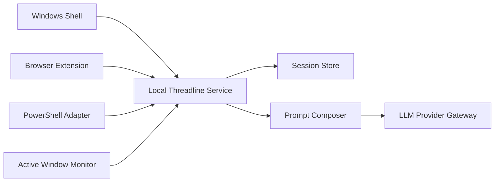

# Architecture

ThreadlineAI has five layers: Windows shell, local service, context adapters, session store, and provider gateway.

The Windows shell owns the side panel, provider picker, session picker, context preview, timeline, and pause controls. The local service is the trusted boundary for adapters. It accepts context events, evaluates capture policy, redacts secrets, stores session data, and composes prompts.

The context broker normalizes browser context, PowerShell transcript output, active window metadata, future UI Automation text, user-selected text, and approved screenshots into a single `ContextEvent` shape.
